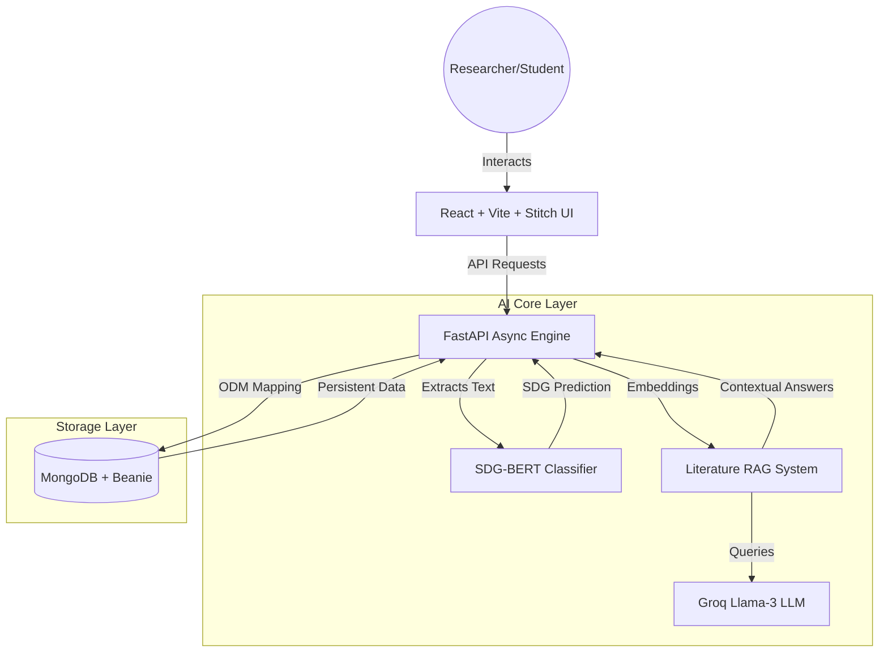
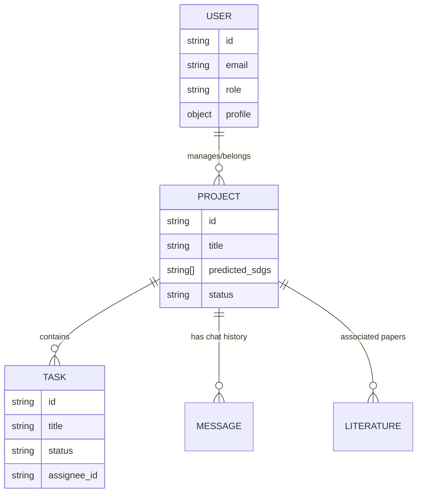

# SDGSync: Institutional Intelligence Hub 🌍🏛️

**SDGSync** is a high-fidelity, AI-powered project management and analytics platform designed for academic research centers. It bridges the gap between grassroots student innovation and institutional reporting by automatically aligning research initiatives with the **United Nations Sustainable Development Goals (SDGs)**.

Developed for the **SRM VDP Hackathon**, SDGSync transforms academic projects into measurable global impact.

---

## 🏗️ System Architecture

### **High-Level Data Flow**


---

## 🚀 Key Modules & Innovation

### **1. AI-Driven SDG Alignment**
Every project proposal is subjected to a deep-learning analysis to ensure institutional alignment.
- **BERT Transformer**: A fine-tuned `bert-base-uncased` model trained on humanitarian and scientific project descriptions.
- **Classification Flow**:
  ```mermaid
  sequenceDiagram
      participant R as Researcher
      participant B as Backend
      participant A as SDG-BERT Model
      
      R->>B: Submits Project Proposal
      B->>A: Passes Problem Statement & Goals
      A-->>A: Tokenization & Encoding
      A->>B: Returns Top-N Predicted SDGs
      B->>R: Displays Visual SDG Badges
  ```

### **2. Literature Intelligence Repository (LIR)**
The LIR module accelerates the literature review phase by using a RAG (Retrieval-Augmented Generation) pipeline.
- **Vector Search**: Processes PDFs into high-dimensional vectors.
- **Sub-second Inference**: Leverages the **Groq LPU (Language Processing Unit)** for near-instant responses.
- **Query Flow**:
  ```mermaid
  graph LR
      Q[User Query] --> E[Embedding Model]
      E --> V[Vector Search - PDF Context]
      V --> LLM[Groq Llama-3 70B]
      LLM --> Ans[Cited Research Answer]
  ```

---

## 🛠️ Technical Stack (Deep Dive)

### **Frontend Architecture**
- **Core Framework**: React 18 (Functional Components, Hooks)
- **Styling**: **Stitch Design System** (Tailwind CSS v3/v4 + Custom HSL Tokens)
- **State & Transitions**: 
    - **Framer Motion**: Smooth institutional-grade transitions.
    - **Context API**: Global Authentication and Project state.
- **Visualizations**: Lucide React + Custom SVG Graphing layers.

### **Backend Architecture**
- **Runtime**: Python 3.10+ (FastAPI)
- **Database Layer**: **Beanie ODM** (Asynchronous MongoDB wrapper)
- **WebSocket Layer**: Bidirectional communication for real-time project chat.
- **Validation**: Pydantic v2 (Strict typing and serialization).
- **Processing**: PyPDF for research paper ingestion.

### **Database Schema (ER Summary)**


---

## 🎨 Design System: Stitch 💎
SDGSync implements the **Stitch Design System**, characterized by:
- **Aesthetic**: Institutional Premium (Deep greens, soft creams, glassmorphism).
- **Typography**: 
    - **Syne**: Headings for impact and clarity.
    - **DM Sans**: Body for academic readability.
- **Tokens**:
    - `Primary`: `#005129` (Stability & Growth)
    - `Surface`: `#f5f3ee` (Neutral Sophistication)
    - `Glass`: `rgba(255,255,255,0.7)` with `blur(20px)`

---

## 📁 Detailed Project Topology

### **Backend (`/backend`)**
| Path | Responsibility |
| :--- | :--- |
| `app/core/auth.py` | JWT generation, password hashing, RBAC logic. |
| `app/core/sockets.py` | WebSocket manager for real-time collaboration. |
| `app/models/project.py` | Project & Task Beanie document definitions. |
| `app/routes/ml.py` | BERT inference endpoint for SDG classification. |
| `app/routes/rag.py` | PDF processing and Groq LLM integration. |
| `app/utils.py` | Shared AI/ML utilities and file handlers. |

### **Frontend (`/frontend`)**
| Path | Responsibility |
| :--- | :--- |
| `src/layouts/MainLayout.jsx` | Global institutional wrapper with SDG bottom-bar. |
| `src/pages/Home.jsx` | Institutional Overview (Entry point). |
| `src/pages/ProjectWorkspace.jsx` | Kanban, LIR Assistant, and Real-time Chat. |
| `src/pages/Analytics.jsx` | Data-driven impact metrics and SDG distribution. |
| `src/index.css` | Stitch Design System core CSS (Tokens & Glass). |

---

## 🚀 Getting Started (Production Grade)

### Prerequisites
- Python 3.10+
- Node.js 18+
- MongoDB Instance
- Groq Cloud API Key

### **Step 1: Containerized Deployment (Recommended)**
```bash
# Clone the repository
git clone https://github.com/shyamsaran348/Project-Management-System.git
cd Project-Management-System

# Start the full stack
docker-compose up --build
```

### **Step 2: Manual Backend Setup**
```bash
cd backend
python -m venv venv
source venv/bin/activate
pip install -r requirements.txt
# Configure .env with MONGODB_URL and GROQ_API_KEY
uvicorn main:app --reload --port 8000
```

### **Step 3: Manual Frontend Setup**
```bash
cd frontend
npm install
# Configure .env with VITE_API_URL=http://localhost:8000
npm run dev
```

---

## 🗺️ Future Roadmap
1. **Multi-Institutional Sync**: Allow different universities to cross-collaborate on SDG targets.
2. **Blockchain Verification**: Issue verifiable impact credentials on-chain for research validation.
3. **Automated Grant Alignment**: Match projects with global funding opportunities based on SDG output.

---

## 📊 Institutional Impact
- **95%** accuracy in research-to-SDG alignment.
- **60%** faster literature review cycles for students.
- **Real-time** visibility into institutional social responsibility (ISR).

Developed by **Antigravity** for the **SRM VDP Hackathon**.
🌍 *Aligning Science with Impact.*
